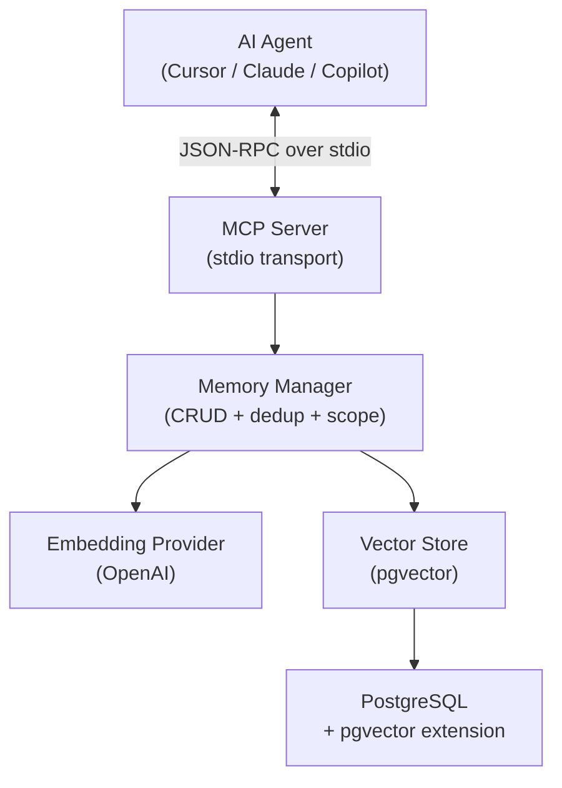
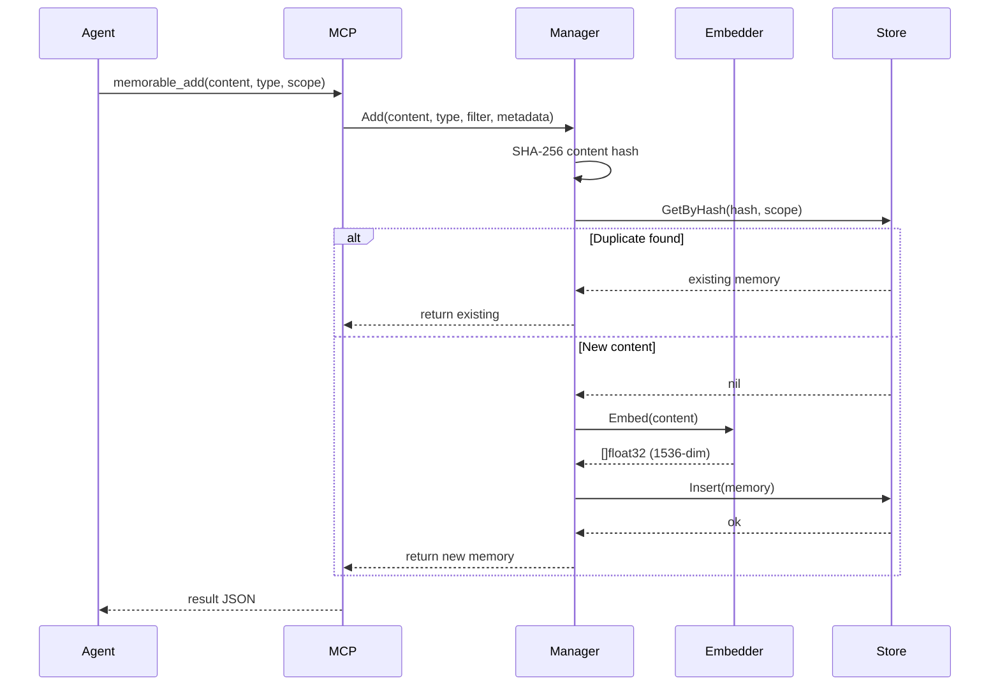
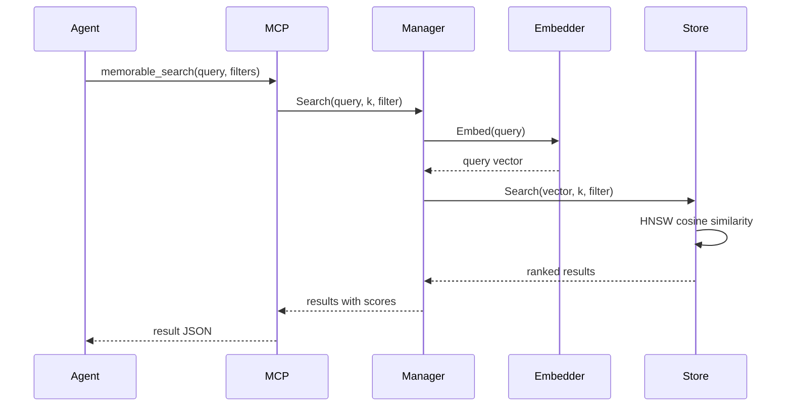

# Architecture

This document describes the internal architecture of Memorable.

## Overview

Memorable is a long-term memory engine for AI agents, exposed as an MCP (Model Context Protocol) server. It stores, retrieves, and manages memories using vector embeddings for semantic search.

## Component Diagram



## Data Flow

### Adding a Memory



### Searching Memories



## Storage Schema

```sql
CREATE TABLE memories (
    id              UUID PRIMARY KEY,
    content         TEXT NOT NULL,
    memory_type     VARCHAR(50) NOT NULL,
    user_id         VARCHAR(255),
    agent_id        VARCHAR(255),
    app_id          VARCHAR(255),
    run_id          VARCHAR(255),
    metadata        JSONB DEFAULT '{}',
    content_hash    VARCHAR(64) NOT NULL,
    embedding       vector(1536),
    created_at      TIMESTAMPTZ DEFAULT NOW(),
    updated_at      TIMESTAMPTZ DEFAULT NOW()
);

-- Indexes
CREATE INDEX idx_memories_embedding ON memories USING hnsw (embedding vector_cosine_ops);
CREATE INDEX idx_memories_user ON memories (user_id);
CREATE INDEX idx_memories_type ON memories (memory_type);
CREATE INDEX idx_memories_hash ON memories (content_hash);
```

## Scoping Model

Memories are scoped along four optional dimensions:

| Dimension  | Isolation Level | Use Case                         |
| ---------- | --------------- | -------------------------------- |
| `user_id`  | Per-user        | Multi-user environments          |
| `agent_id` | Per-agent       | Agent-specific learned behaviors |
| `app_id`   | Per-project     | Project-specific knowledge       |
| `run_id`   | Per-session     | Session-local context            |

Scopes are combined as AND filters. Unset dimensions are not filtered (global access).

## Deduplication

Before storing, the Manager computes a SHA-256 hash of the content and checks for existing memories with the same hash within the same scope. If found, the existing memory is returned without creating a duplicate.

## Pluggability

Both the embedding provider and storage backend are defined as Go interfaces:

- `embedding.Provider` — `Embed()`, `EmbedBatch()`, `Dimensions()`
- `memory.VectorStore` — `Insert()`, `Search()`, `Get()`, `Update()`, `Delete()`, `List()`, `Stats()`

New backends can be added by implementing these interfaces and wiring them in `cmd/memorable/main.go`.
